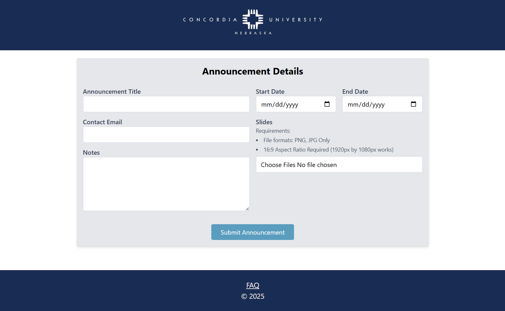
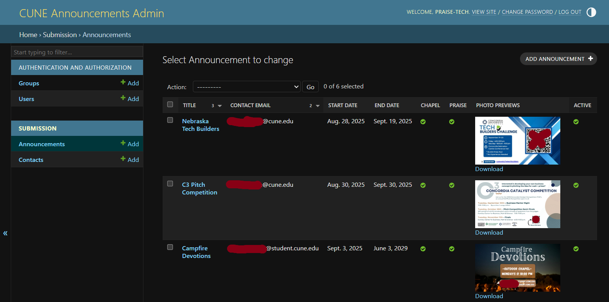

# CUNE Announcements
## Overview
This is a site that allows Concordia University students and faculty to submit announcements for chapel and praise services. It ensures that announcements are sent to the correct location and in the correct format for use.

## Why Make This Site?
Previously, announcements were consistently sent to the wrong people in the wrong format. This app eliminates both of those problems by having all announcements sent to one centralized location, and by requiring them to be in the correct format.

## How It Was Built
- **Tech Stack:** Django, Tailwind CSS, SQLite
- **Features:** Secure form submission for announcements, centralized access to announcements and information
- **Outcome:** Reduced time and complexity for tech volunteers
- **Deployment** Deployed securely on Concordia's servers

## Screenshots
**User View**


**Producer View**


## Usage
#### Cloning Down The Code
1. Run ```gh repo clone Galacticica/CUNE-Announcement-Site```
2. Run ```uv sync```
3. Run ```uv run manage.py migrate```
4. Add a ```.env``` file and add the following:
     ```
     DEBUG = 1
     SECRET_KEY = whatever you want
     EMAIL_KEY = whatever
     ```

#### Run Locally
1. In the terminal, run ```uv run manage.py runserver```

## Contact
### Email : reaganzierke@gmail.com
### Discord : galacticica

